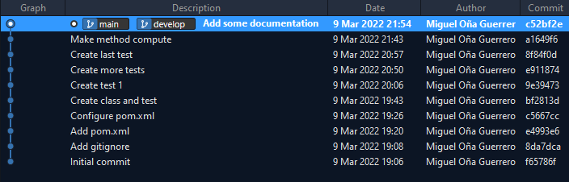

# pruebas-fibonacci

This repository was created with the objective of testing a Fibonacci sequence function using jUnit 5, for the subject Mantenimiento y Pruebas del Software.

## Files

- *Fibonacci.java* : class that implements *compute(int n)*, a method that returns the n-positioned number in Fibonacci sequence.
- *FibonacciTest.java* : class containing tests with jUnit 5, for testing *compute* method. In this class we can find the following test cases:
  *  Should compute zero if number is zero.
  *  Should compute one if number is one.
  *  Should compute one if number is two.
  *  Should compute two if number is three.
  *  Should compute three if number is four.
  *  Should compute thirteen if number is seven.
  *  Should compute 144 if number is twelve.
  *  Should raise an exception if number is negative.

With these tests, we can obtaing a 100% coverage.

## Commits

The final commits tree looks like this:

